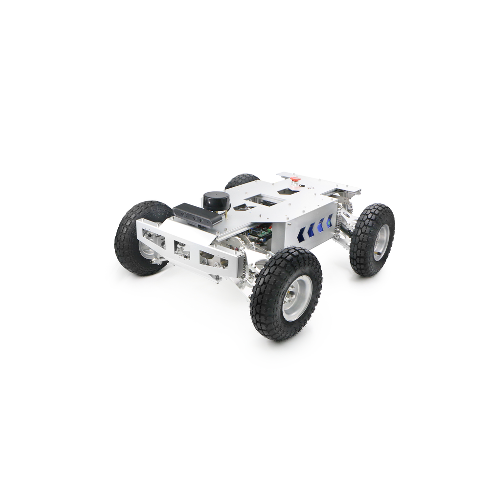

<!-- Improved compatibility of back to top link: See: https://github.com/othneildrew/Best-README-Template/pull/73 -->
<a name="readme-top"></a>
<!--
*** Thanks for checking out the Best-README-Template. If you have a suggestion
*** that would make this better, please fork the repo and create a pull request
*** or simply open an issue with the tag "enhancement".
*** Don't forget to give the project a star!
*** Thanks again! Now go create something AMAZING! :D
-->


<!-- PROJECT SHIELDS -->
<!--
*** I'm using markdown "reference style" links for readability.
*** Reference links are enclosed in brackets [ ] instead of parentheses ( ).
*** See the bottom of this document for the declaration of the reference variables
*** for contributors-url, forks-url, etc. This is an optional, concise syntax you may use.
*** https://www.markdownguide.org/basic-syntax/#reference-style-links
-->
[![Contributors][contributors-shield]][contributors-url]
[![Forks][forks-shield]][forks-url]
[![Stargazers][stars-shield]][stars-url]
[![Issues][issues-shield]][issues-url]
[![MIT License][license-shield]][license-url]
[![LinkedIn][linkedin-shield]][linkedin-url]


<!-- PROJECT LOGO -->
<br />
<div align="center">
  <a href="https://www.roboworks.net/">
    
  </a>

  <h3 align="center">Roboworks Rosbot</h3>

  <p align="center">
    This project contains all the packages neccessary to run the Rosbot!
    <br />
    <a href="https://bitbucket.org/roboworkscode/rosbot/"><strong>Explore the docs »</strong></a>
  </p>
</div>


<!-- TABLE OF CONTENTS -->
<details>
  <summary>Table of Contents</summary>
  <ol>
    <li>
      <a href="#about-the-project">About The Project</a>
      <ul>
        <li><a href="#built-with">Built With</a></li>
      </ul>
    </li>
    <li>
      <a href="#getting-started">Getting Started</a>
      <ul>
        <li><a href="#prerequisites">Prerequisites</a></li>
        <li><a href="#installation">Installation</a></li>
      </ul>
    </li>
    <li><a href="#usage">Usage</a></li>
    <li><a href="#roadmap">Roadmap</a></li>
    <li><a href="#contributing">Contributing</a></li>
    <li><a href="#license">License</a></li>
    <li><a href="#contact">Contact</a></li>
    <li><a href="#acknowledgments">Acknowledgments</a></li>
  </ol>
</details>

</br>

<!-- ABOUT THE PROJECT -->
## About The Project
<p align="center">
  <a href="https://www.roboworks.net/store-homepage">
  
  </a>
</p>

The Rosbot is ...

### Packages
The following packages are currently provided and maintained to provide basic functionality to the Rosbot:

- https://bitbucket.org/roboworkscode/rosbot_node/
- https://bitbucket.org/roboworkscode/rosbot_drivers/
- https://bitbucket.org/roboworkscode/rosbot_description/
- https://bitbucket.org/roboworkscode/rosbot_perception/
- https://bitbucket.org/roboworkscode/rosbot_slam/
- https://bitbucket.org/roboworkscode/rosbot_navigation/
- https://bitbucket.org/roboworkscode/rosbot_utils/

<p align="right">(<a href="#readme-top">back to top</a>)</p>


<!-- GETTING STARTED -->
## Getting Started

### Prerequisites

The packages in this repository is built on the ROS2 framework. The Robot Operating System (ROS) is a set of software libraries and tools for building robot applications. Please refer to the following URL and install ROS2 galactic and tools.
- https://docs.ros.org/en/galactic/Installation/Ubuntu-Install-Debians.html
- https://docs.ros.org/en/galactic/Tutorials/Colcon-Tutorial.html
- https://docs.ros.org/en/galactic/How-To-Guides/Building-a-Custom-Debian-Package.html

Ceratin packages also require specific dependencies, please refer to the individual READMEs for each package.

<p align="right">(<a href="#readme-top">back to top</a>)</p>

### Installation

1. Set up SSH keys on Bitbucket
2. Clone the repo into your workspace src directory
   ```sh
   mkdir ~/rosbot_workspace ~/rosbot_workspace/src
   cd ~/rosbot_workspace/src
   git clone git@bitbucket.org:roboworkscode/rosbot.git --recurse-submodules
   ```
3. Build the packages
   ```sh
   cd ~/rosbot_workspace
   colcon build
   ```
4. Source the install
   ```sh
   . install/setup.sh
   ```

5. Your workspace should look like the following
  ```
  ~/rosbot_workspace/
  └─ build/
  └─ log/
  └─ install/
      └─ setup.bash
      └─ ...
  └─ src/
      └─ rosbot/
          └─ rosbot_node/
          └─ rosbot_description/
          └─ ...
  ```

<p align="right">(<a href="#readme-top">back to top</a>)</p>


<!-- USAGE EXAMPLES -->
## Usage

To launch a package use the following command:
```sh
  ros2 launch <package name> <launch file>
```

### Debugging

<p align="right">(<a href="#readme-top">back to top</a>)</p>


<!-- CONTRIBUTING -->
## Contributing

TODO

<p align="right">(<a href="#readme-top">back to top</a>)</p>


<!-- LICENSE -->
## License

TODO

<p align="right">(<a href="#readme-top">back to top</a>)</p>


<!-- CONTACT -->
## Contact

TODO

Your Name - [@your_twitter](https://twitter.com/your_username) - email@example.com

Project Link: [https://github.com/your_username/repo_name](https://github.com/your_username/repo_name)

<p align="right">(<a href="#readme-top">back to top</a>)</p>


<!-- ACKNOWLEDGMENTS -->
## Acknowledgments

Use this space to list resources you find helpful and would like to give credit to. I've included a few of my favorites to kick things off!

* [Choose an Open Source License](https://choosealicense.com)
* [GitHub Emoji Cheat Sheet](https://www.webpagefx.com/tools/emoji-cheat-sheet)
* [Malven's Flexbox Cheatsheet](https://flexbox.malven.co/)
* [Malven's Grid Cheatsheet](https://grid.malven.co/)
* [Img Shields](https://shields.io)
* [GitHub Pages](https://pages.github.com)
* [Font Awesome](https://fontawesome.com)
* [React Icons](https://react-icons.github.io/react-icons/search)

<p align="right">(<a href="#readme-top">back to top</a>)</p>


<!-- MARKDOWN LINKS & IMAGES -->
<!-- https://www.markdownguide.org/basic-syntax/#reference-style-links -->
[contributors-shield]: https://img.shields.io/github/contributors/othneildrew/Best-README-Template.svg?style=for-the-badge
[contributors-url]: https://github.com/othneildrew/Best-README-Template/graphs/contributors
[forks-shield]: https://img.shields.io/github/forks/othneildrew/Best-README-Template.svg?style=for-the-badge
[forks-url]: https://github.com/othneildrew/Best-README-Template/network/members
[stars-shield]: https://img.shields.io/github/stars/othneildrew/Best-README-Template.svg?style=for-the-badge
[stars-url]: https://github.com/othneildrew/Best-README-Template/stargazers
[issues-shield]: https://img.shields.io/github/issues/othneildrew/Best-README-Template.svg?style=for-the-badge
[issues-url]: https://github.com/othneildrew/Best-README-Template/issues
[license-shield]: https://img.shields.io/github/license/othneildrew/Best-README-Template.svg?style=for-the-badge
[license-url]: https://github.com/othneildrew/Best-README-Template/blob/master/LICENSE.txt
[linkedin-shield]: https://img.shields.io/badge/-LinkedIn-black.svg?style=for-the-badge&logo=linkedin&colorB=555
[linkedin-url]: https://linkedin.com/in/othneildrew

[ros]: https://img.shields.io/ros/v/galactic/rclcpp
[ros-url]: https://docs.ros.org/en/galactic/index.html